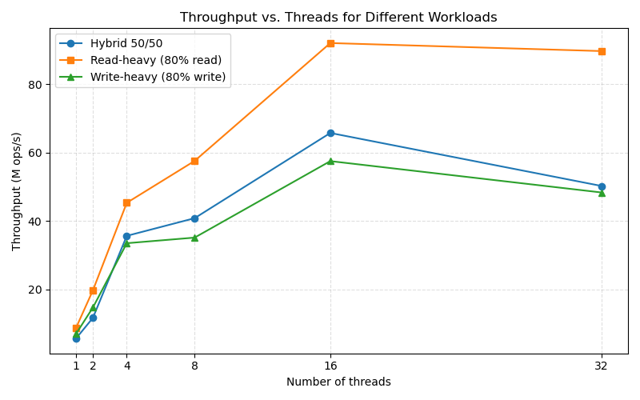

# High-Performance Concurrent Cuckoo Hash Map in Rust

A concurrent hash map implementation using cuckoo hashing, providing O(1) expected time lookups and amortized O(1) insertions with support for concurrent multi-threaded access.

## Team Members

| Name         | Student ID | Email                      |
|--------------|------------|----------------------------|
| Xiangyu Liu  | 1006743179 | swift.liu@mail.utoronto.ca |
| Yilin Huai   | 1001297036 | yilin.huai@mail.utoronto.ca|

## Video Slide Presentation

Watch our project presentation:

[https://youtu.be/NjZb76y8ks0](https://youtu.be/NjZb76y8ks0)

## Video Demo

Watch our demonstration of the CuckooHashMap in action:

[https://youtu.be/FMv8x93ZVrE](https://youtu.be/FMv8x93ZVrE)

## Motivation

Concurrent hash tables are fundamental building blocks in systems such as caches, databases, schedulers, and real-time analytics pipelines. In Rust, existing solutions like `DashMap` and `RwLock<HashMap>` focus on usability or basic thread-safety, but they often lack **predictable performance** under heavy, mixed workloads.

Our project was motivated by the need for a **high-performance concurrent hash table in Rust** that:

- Supports efficient multi-threaded access to shared key-value pairs
- Provides **O(1) worst-case lookup time** through cuckoo hashing (unlike chaining-based approaches)
- Implements **optimistic lock-free reads** to minimize contention in read-heavy workloads
- Uses **fine-grained locking** with striped locks to maximize parallelism for write operations
- Offers a clean, ergonomic API similar to Rust's standard `HashMap`

The cuckoo hashing algorithm, as described in the EuroSys 2014 paper "Algorithmic Improvements for Fast Concurrent Cuckoo Hashing" by Li et al., provides excellent cache locality and deterministic probe sequences, making it ideal for high-performance concurrent scenarios.

## Objectives

The primary objectives of this project are:

1. **Implement a concurrent cuckoo hash map** that achieves high throughput across diverse workloads (read-heavy, write-heavy, and mixed)

2. **Provide O(1) expected time complexity** for all core operations (`get`, `insert`, `remove`) through the cuckoo hashing algorithm

3. **Optimize for read-heavy workloads** using optimistic lock-free reads with version counters, falling back to locked reads only if three consecutive modification retries are detected.

4. **Support dynamic resizing** that automatically doubles the table capacity when needed

5. **Offer a safe, ergonomic API** that feels familiar to Rust developers while maintaining thread-safety guarantees

## Features

### Core Operations

| Method | Description |
|--------|-------------|
| `new()` | Create an empty hash map with default capacity |
| `with_capacity(n)` | Create a hash map with at least capacity for `n` elements |
| `insert(key, value)` | Insert or update a key-value pair; returns old value if key existed |
| `get(key)` | Retrieve a clone of the value for the given key |
| `remove(key)` | Remove and return the value for the given key |
| `contains_key(key)` | Check if a key exists in the map |
| `len()` | Return the number of elements |
| `is_empty()` | Check if the map is empty |
| `clear()` | Remove all elements |
| `capacity()` | Return the current capacity |
| `load_factor()` | Return the current load factor (len / capacity) |

### Iteration Support

| Method | Description |
|--------|-------------|
| `iter()` | Iterator over (key, value) pairs |
| `keys()` | Iterator over keys |
| `values()` | Iterator over values |
| `into_iter()` | Consuming iterator |

### Configuration

| Method | Description |
|--------|-------------|
| `set_minimum_load_factor(f)` | Set minimum load factor before expansion (0.0 to 1.0) |
| `set_maximum_hashpower(hp)` | Set maximum hashpower to limit table size |

### Trait Implementations

- `Clone` - Deep copy of the hash map
- `Debug` - Debug formatting for maps with Debug keys and values
- `Default` - Create an empty map with default hasher
- `FromIterator` - Construct from an iterator of (K, V) pairs
- `Extend` - Extend the map with an iterator of (K, V) pairs
- `IntoIterator` - Convert into an iterator
- `Send + Sync` - Thread-safe across threads

### Technical Features

1. **Optimistic Lock-Free Reads**: Read operations first attempt a lock-free path using version counters. Only if three consecutive write is detected do they fall back to acquiring locks.

2. **Fine-Grained Striped Locking**: Write operations use striped spinlocks, allowing concurrent writes to different portions of the table.

3. **BFS-Based Cuckoo Path Search**: When both candidate buckets are full, a breadth-first search finds an eviction path to make room for the new element.

4. **Dynamic Resizing**: When inserts exhaust both candidate buckets, the table automatically doubles; it grabs all stripe locks, rebuilds the bucket array, and rehashes all items into their new positions.

5. **Partial Key Optimization**: An 8-bit partial key derived from the hash enables fast rejection of non-matching entries without full key comparison.

## Developer's Guide

### Adding as a Dependency

Add to your `Cargo.toml`:

```toml
[dependencies]
cuckoo-hashmap = { path = "path/to/cuckoo-hashmap" }
```

Or if published to crates.io:

```toml
[dependencies]
cuckoo-hashmap = "0.1.0"
```

### Basic Usage

```rust
use cuckoo_hashmap::CuckooHashMap;

fn main() {
    // Create a new map
    let map = CuckooHashMap::new();

    // Insert key-value pairs
    map.insert("apple", 3).unwrap();
    map.insert("banana", 5).unwrap();
    map.insert("cherry", 7).unwrap();

    // Retrieve values
    assert_eq!(map.get(&"apple"), Some(3));
    assert_eq!(map.get(&"grape"), None);

    // Check existence
    assert!(map.contains_key(&"banana"));

    // Update existing key (returns old value)
    let old = map.insert("apple", 10).unwrap();
    assert_eq!(old, Some(3));

    // Remove a key
    let removed = map.remove(&"cherry");
    assert_eq!(removed, Some(7));

    // Iterate over entries
    for (key, value) in map.iter() {
        println!("{}: {}", key, value);
    }
}
```

### Concurrent Usage

The map is safe to share across threads using `Arc`:

```rust
use cuckoo_hashmap::CuckooHashMap;
use std::sync::Arc;
use std::thread;

fn main() {
    let map = Arc::new(CuckooHashMap::new());
    let mut handles = vec![];

    // Spawn writer threads
    for i in 0..4 {
        let map = Arc::clone(&map);
        handles.push(thread::spawn(move || {
            for j in 0..1000 {
                let key = i * 1000 + j;
                map.insert(key, key * 2).unwrap();
            }
        }));
    }

    // Spawn reader threads
    for _ in 0..4 {
        let map = Arc::clone(&map);
        handles.push(thread::spawn(move || {
            for key in 0..4000 {
                let _ = map.get(&key);
            }
        }));
    }

    for handle in handles {
        handle.join().unwrap();
    }

    println!("Final size: {}", map.len());
}
```

### Using with Custom Types

Keys must implement `Hash + Eq + Clone`, and values must implement `Clone`:

```rust
use cuckoo_hashmap::CuckooHashMap;

#[derive(Hash, Eq, PartialEq, Clone, Debug)]
struct UserId(u64);

#[derive(Clone, Debug)]
struct User {
    name: String,
    email: String,
}

fn main() {
    let users: CuckooHashMap<UserId, User> = CuckooHashMap::new();

    users.insert(
        UserId(1),
        User {
            name: "Alice".to_string(),
            email: "alice@example.com".to_string(),
        }
    ).unwrap();

    if let Some(user) = users.get(&UserId(1)) {
        println!("Found user: {:?}", user);
    }
}
```

### Configuration Options

```rust
use cuckoo_hashmap::CuckooHashMap;

fn main() {
    // Create with specific capacity
    let map: CuckooHashMap<i32, i32> = CuckooHashMap::with_capacity(10000);

    // Configure load factor threshold
    map.set_minimum_load_factor(0.25);

    // Limit maximum table size (hashpower = log2 of bucket count)
    map.set_maximum_hashpower(20); // Max ~4M buckets

    // Check current stats
    println!("Capacity: {}", map.capacity());
    println!("Load factor: {:.2}", map.load_factor());
    println!("Hashpower: {}", map.hashpower());
}
```

### Error Handling

Insert operations return a `Result` that may contain errors:

```rust
use cuckoo_hashmap::{CuckooHashMap, CuckooError};

fn main() {
    let map: CuckooHashMap<i32, i32> = CuckooHashMap::new();
    map.set_maximum_hashpower(2); // Very small limit

    // Fill the map
    for i in 0..100 {
        match map.insert(i, i) {
            Ok(old_value) => {
                if let Some(old) = old_value {
                    println!("Updated key {}, old value was {}", i, old);
                }
            }
            Err(CuckooError::MaximumHashpowerExceeded { current, requested, maximum }) => {
                println!("Cannot grow table: current={}, requested={}, max={}",
                         current, requested, maximum);
                break;
            }
            Err(e) => println!("Error: {:?}", e),
        }
    }
}
```

## Reproducibility Guide

### Prerequisites

- **Rust**: Version 1.70.0 or later (2021 edition)
- **Cargo**: Comes with Rust installation

### Setup Instructions

#### On Ubuntu Linux

```bash
# Install Rust (if not already installed)
curl --proto '=https' --tlsv1.2 -sSf https://sh.rustup.rs | sh
source $HOME/.cargo/env

# Clone the repository
git clone https://github.com/SwiftLiuu/High-Performance-Concurrent-Hashmap-in-Rust.git
cd High-Performance-Concurrent-Hashmap-in-Rust

# Build the project
cargo build --release

# Run all tests
cargo test

# Run tests with output
cargo test -- --nocapture
```

#### On macOS

```bash
# Install Rust (if not already installed)
curl --proto '=https' --tlsv1.2 -sSf https://sh.rustup.rs | sh
source $HOME/.cargo/env

# Clone the repository
git clone https://github.com/SwiftLiuu/High-Performance-Concurrent-Hashmap-in-Rust.git
cd High-Performance-Concurrent-Hashmap-in-Rust

# Build the project
cargo build --release

# Run all tests
cargo test

# Run tests with output
cargo test -- --nocapture
```

### Running Benchmarks

The project includes several benchmark workloads:

```bash
# Run all benchmarks (takes ~60 seconds)
cargo test --release -- --nocapture

# Run specific benchmark
cargo test --release read_heavy -- --nocapture
cargo test --release write_heavy -- --nocapture
cargo test --release hybrid_50_50 -- --nocapture

# Run basic functionality tests only
cargo test --release basic_operations -- --nocapture
```

### Expected Output

Running the benchmarks should produce output similar to:

```
read-heavy: threads=1 → throughput = 8.65 M ops/s
read-heavy: threads=2 → throughput = 19.68 M ops/s
read-heavy: threads=4 → throughput = 45.31 M ops/s
read-heavy: threads=8 → throughput = 57.56 M ops/s
read-heavy: threads=16 → throughput = 92.03 M ops/s
read-heavy: threads=32 → throughput = 89.68 M ops/s

```

(Numbers recorded on AMD Ryzen 9 3950X 16-core, 32-thread; actual numbers will vary based on hardware)



In our runs, throughput scales almost linearly up to 16 threads on the 3950X and then flattens, with a slight dip at 32 threads. This matches expectations: optimistic reads keep contention low at modest core counts, while cache and lock striping pressure start to dominate once we oversubscribe the L3 and saturate memory bandwidth.

### Using as a Library

To use this crate in your own project:

```bash
# In your project directory
cargo add cuckoo-hashmap --path /path/to/High-Performance-Concurrent-Hashmap-in-Rust
```

Or add manually to `Cargo.toml`:

```toml
[dependencies]
cuckoo-hashmap = { path = "/path/to/High-Performance-Concurrent-Hashmap-in-Rust" }
```

## Contributions by Team Members

### Xiangyu Liu

- Designed and implemented the core cuckoo hashing algorithm
- Implemented bucket and slot storage structures (`bucket.rs`)
- Developed the BFS-based cuckoo path search for collision resolution
- Implemented the dynamic resizing and rehashing logic
- Created the hash utilities including partial key computation (`hash.rs`)
- Wrote unit tests for basic operations

### Yilin Huai

- Designed and implemented the synchronization mechanisms (`lock.rs`)
- Implemented optimistic lock-free read path with version counters
- Developed the striped spinlock system for fine-grained concurrency
- Implemented iterator support (`iter.rs`)
- Created the error handling system (`error.rs`)
- Developed the concurrent benchmark workloads
- Set up the project structure and configuration (`config.rs`)

### Joint Contributions

- API design and documentation
- Integration testing
- Performance optimization
- Code review and debugging
- Final report preparation

## Lessons Learned and Concluding Remarks

### Technical Lessons

1. **Optimistic Concurrency is Powerful**: The optimistic lock-free read path significantly improves read performance in read-heavy workloads. By using version counters and only falling back to locks when modifications are detected, we achieved much higher throughput than a simple lock-based approach.

2. **Cuckoo Hashing Complexity**: While cuckoo hashing provides excellent lookup performance, implementing the BFS-based displacement path search and handling edge cases (cycles, resize triggers) required careful design. The interaction between concurrent operations and the cuckoo displacement algorithm was particularly challenging.

3. **Rust's Ownership Model**: Rust's strict ownership rules forced us to carefully design our data structures. Using `UnsafeCell` for interior mutability while maintaining safety invariants through locks required thorough understanding of Rust's memory model.

4. **Atomic Operations**: Implementing `AtomicF64` (since Rust doesn't provide one) using bit-casting to `AtomicU64` taught us about the flexibility and limitations of atomic operations.

5. **Testing Concurrent Code**: Writing correct concurrent tests is challenging. Race conditions may not manifest in every run. We learned to use barriers for synchronization and to run tests multiple times with varying thread counts.

6. **Throughput Plateauing with More Threads**: Scaling is nearly linear up to mid-core counts, but beyond that caches and memory bandwidth dominate, and contention on striped locks flattens or slightly reduces throughput—more threads do not always mean more speed.


### Concluding Remarks

This project provided valuable hands-on experience with concurrent data structure design in Rust. The cuckoo hash map implementation demonstrates that it's possible to achieve both safety and high performance in Rust, leveraging the language's type system to prevent data races while still allowing low-level optimizations where needed.

The combination of cuckoo hashing's O(1) worst-case lookups with optimistic lock-free reads makes this implementation particularly suitable for read-heavy concurrent workloads, which are common in many real-world systems.

## References

- Xiaozhou Li, David G. Andersen, Michael Kaminsky, Michael J. Freedman.  
  *Algorithmic Improvements for Fast Concurrent Cuckoo Hashing*.  
  In *Proceedings of EuroSys ’14*, Amsterdam, Netherlands, April 2014. ACM, pp. 27–40.  
  DOI: [10.1145/2592798.2592820](https://doi.org/10.1145/2592798.2592820)

- Josh Triplett, Paul E. McKenney, Jonathan Walpole.  
  *Resizable, Scalable, Concurrent Hash Tables via Relativistic Programming*.  
  In *Proceedings of the Linux Symposium / USENIX OLS (ATC 2011)*, July 2010, Ottawa, Canada, pp. 71–80.  
  [PDF Link](https://www.usenix.org/legacy/event/atc11/tech/final_files/Triplett.pdf)

- Tobias Maier, Peter Sanders, and Roman Dementiev.  
  *Concurrent Hash Tables: Fast and General(?)!*  
  *ACM Transactions on Parallel Computing*, Vol. 5, No. 4, Article 16, February 2019, pp. 1–32.  
  DOI: [10.1145/3309206](https://doi.org/10.1145/3309206)

- Zhiwen Chen, Xin He, Jianhua Sun, Hao Chen, Ligang He.  
  *Concurrent Hash Tables on Multicore Machines: Comparison, Evaluation and Implications*.  
  *Future Generation Computer Systems*, Vol. 82, 2018, pp. 127–141. Elsevier.  
  DOI: [10.1016/j.future.2017.12.054](https://doi.org/10.1016/j.future.2017.12.054)

- Alexey A. Paznikov, Vadim A. Smirnov, Artur R. Omelnichenko.  
  *Towards Efficient Implementation of Concurrent Hash Tables and Search Trees Based on Software Transactional Memory*.  
  In *Proceedings of FarEastCon 2019*, IEEE, pp. 1–6.  
  DOI: [10.1109/FarEastCon.2019.8934131](https://doi.org/10.1109/FarEastCon.2019.8934131)

- Julian Shun, Guy E. Blelloch.  
  *Phase-Concurrent Hash Tables for Determinism*.  
  In *Proceedings of the 26th ACM Symposium on Parallelism in Algorithms and Architectures (SPAA ’14)*, Prague, Czech Republic, June 2014, pp. 96–105. ACM.  
  DOI: [10.1145/2612669.2612687](https://doi.org/10.1145/2612669.2612687)


